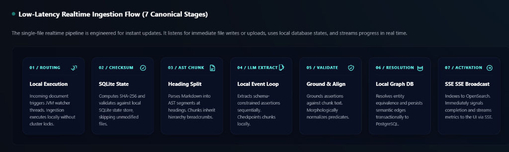
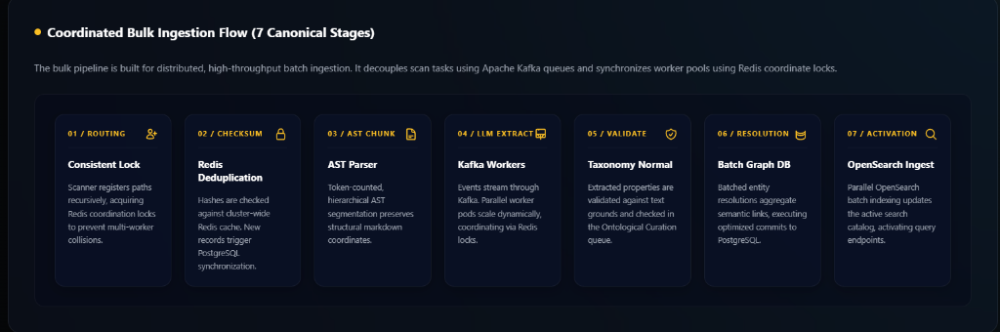

# Noesis
---

## 1. The Problem Statement

Chunk-based vector RAG breaks down in three major failure modes:

- **Multi-hop queries** — "What services depend on the database the billing module writes to?" requires traversing connections across documents. Vector similarity has no edge model, it retrieves isolated chunks and relies on the LLM to synthesize the path.
- **Non deterministic retrieval** - Two semantically similar chunks can rank differently when embeddding model changes, chunking changes,documents are edited or the index rebuilds, making audits difficult in operational systems. Retrieval is not reproducible.
- **Provenance Collapse** — a vector match returns a similarity score and a chunk. There is no way to trace *why* two facts are related or what document chain produced them. The retrieval layer cannot explain the traversal path that connected the result.

Nosesis shifts relationship extraction from query time to ingestion time.it converts document chunks into structured assertions, then derives graoh nodes and edges from those assertions. Queries traverse  these relationships deterministically, and every result links back to the originating assertion, chunk, and section in a source document for provenance.

## 2. System Architecture

Noesis processes documents through a staged ingestion pipeline designed for deterministic recovery, distributed execution, and provenance preservation.

Each stage persists intermediate state so failed ingestion runs can resume without reprocessing completed work.

### Pipeline Flows

Noesis supports two specialized ingestion pipelines tailored for different operational requirements:

#### 1. Low-Latency Realtime Ingestion Flow (7 Canonical Stages)
The single-file realtime pipeline is engineered for instant updates. It listens for immediate file writes or uploads, uses local database states, and streams progress in real time.



#### 2. Coordinated Bulk Ingestion Flow (7 Canonical Stages)
The bulk pipeline is built for distributed, high-throughput batch ingestion. It decouples scan tasks using Apache Kafka queues and synchronizes worker pools using Redis coordinate locks.



---

## 1. Ingestion Initialization & Distributed Routing

Documents enter the pipeline through API uploads or filesystem discovery.

In Bulk mode, document ownership is distributed across workers using consistent hashing and Redis-backed coordination locks. Each document path receives a short-lived distributed lock to prevent duplicate ingestion when multiple workers discover the same file simultaneously.

In Real-Time mode, ingestion executes locally without distributed coordination.

### Guarantees

- Duplicate ingestion is prevented across workers
- File ownership remains deterministic during bulk processing
- Crashed workers release ownership automatically after lock expiry

### Tradeoffs

- Redis availability is required for Bulk mode coordination
- Stale workers are only detected after heartbeat timeout expiration

---

## 2. Checksum Deduplication & State Synchronization

Before processing begins, Noesis computes a SHA-256 checksum of the document contents.

In Real-Time mode, the checksum is compared against a local SQLite state store. Documents whose checksum matches an already-queryable version are skipped immediately.

In Bulk mode, checksums are validated against a shared Redis cache to prevent duplicate ingestion across workers. New documents are persisted to PostgreSQL and emitted into the event pipeline.

### Guarantees

- Unchanged documents are skipped without triggering LLM extraction
- Deduplication works across both single-node and distributed deployments
- State transitions survive process restarts

### Tradeoffs

- Bulk mode depends on Redis consistency for cluster-wide deduplication
- Real-Time mode prioritizes low-latency local processing over distributed durability

---

## 3. AST-Based Document Chunking

Markdown documents are parsed into an Abstract Syntax Tree (AST) and segmented at heading boundaries instead of fixed-size overlapping windows.

Each chunk inherits a breadcrumb path derived from the heading hierarchy (for example: `Architecture > Retrieval > BFS Traversal`). The resulting chunk preserves structural context for downstream extraction.

Chunks are normalized, token-counted using the configured tokenizer, and assigned deterministic checksums.

### Guarantees

- Chunk boundaries remain stable across ingestion runs
- Structural document hierarchy is preserved
- Assertions retain section-level provenance

### Tradeoffs

- Documents with weak heading structure produce lower-quality segmentation
- Chunk sizes vary depending on document organization

---

## 4. Assertion Extraction & Recovery Checkpointing

Chunks are processed through an LLM extraction stage that converts raw text into structured assertions.

In Real-Time mode, chunks execute sequentially through a local event loop. Completed chunks are checkpointed locally so interrupted ingestion resumes from the exact failure point.

In Bulk mode, chunk events are distributed through Kafka. Workers coordinate extraction ownership using Redis locks to ensure only one worker performs extraction for a document at a time.

LLM responses are constrained to a predefined assertion schema and canonical predicate set.

### Guarantees

- Failed ingestion resumes without repeating completed extraction work
- Distributed workers do not duplicate LLM inference
- Extraction results remain schema-constrained

### Tradeoffs

- LLM inference remains the dominant latency and cost bottleneck
- Bulk ingestion depends on Kafka and Redis availability

---

## 5. Assertion Validation & Predicate Normalization

Extracted assertions pass through a validation stage before entering the graph.

Assertions are grounded against the original chunk text to reduce hallucinated relationships. Predicates are normalized against a canonical taxonomy using exact matching, alias resolution, and lightweight morphological normalization.

Unknown predicates are routed to a review queue for operator approval.

### Guarantees

- Assertions remain traceable to source text
- Predicate relationships remain schema-consistent across documents
- Invalid predicates cannot silently enter the graph

### Tradeoffs

- Strict grounding may reject partially-correct assertions
- Predicate review introduces operational overhead at high ingestion volume

---

## 6. Graph Resolution & Relationship Persistence

Subjects and objects extracted from assertions are normalized into canonical graph entities.

Resolved entities are merged across documents using normalized hashes, allowing semantically identical concepts to map to the same graph node. Relationships are deduplicated before persistence.

Assertions retain foreign-key links back to their originating nodes, chunks, and source documents.

### Guarantees

- Equivalent entities resolve into shared graph nodes
- Duplicate relationships are not reinserted
- Graph relationships remain traceable to originating assertions

### Tradeoffs

- Aggressive normalization may incorrectly merge unrelated entities
- Entity resolution quality depends on naming consistency in source documents

---

## 7. Search Indexing & Query Activation

Resolved assertions and graph relationships are indexed into OpenSearch for BM25 retrieval.

Once indexing completes, the document transitions into a queryable state and becomes available to traversal APIs. Real-time ingestion metrics are broadcast to active dashboards through server-sent events (SSE).

### Guarantees

- Query APIs only expose fully indexed documents
- Search indexing remains decoupled from transactional graph persistence
- Ingestion metrics update in real time

### Tradeoffs

- OpenSearch indexing lag can temporarily delay query availability
- Bulk indexing throughput may saturate modest hardware under heavy ingestion load

## 3. Architectural Tradeoffs

| Design Choice | Benefit | Cost |
|---|---|---|
| LLM-based graph extraction | Multi-hop traversal becomes deterministic and auditable | High ingestion latency and token cost |
| Event-sourced ingestion | Failed stages replay without reprocessing documents | Kafka becomes operationally required in Bulk mode |
| Redis worker coordination | Bulk ingestion scales horizontally without a central scheduler | Worker recovery depends on heartbeat expiration and distributed lock TTLs |
| Exact-edge BFS traversal | Query paths remain explainable and reproducible | Semantic fuzziness is weaker than vector retrieval |
| Predicate normalization and review | Graph relationships remain schema-consistent | Human review queues introduce operational overhead |
| AST-based chunking | Structural context is preserved during extraction | Poorly structured documents segment poorly |
| Assertion grounding validation | Reduces hallucinated relationships | Strict validation may reject partially-correct assertions |
| Batch graph persistence | Reduces database contention during ingestion | Larger batches increase replay complexity on failure |

## 4. Failure Handling & Recoverability

Noesis is designed to tolerate partial failures during ingestion without restarting the entire pipeline.

Each ingestion stage persists recovery state independently so interrupted documents can resume from the last successful checkpoint instead of restarting from the beginning.

---

### Distributed Lock Contention

Bulk ingestion uses Redis-backed distributed locks to prevent multiple workers from processing the same document simultaneously.

If a worker cannot acquire ownership for a document path, the ingestion request exits immediately without triggering database writes or LLM extraction.

#### Recovery Behavior

- Duplicate ingestion events are dropped before pipeline execution begins
- Expired locks automatically release ownership from crashed workers
- Worker ownership is reassigned through heartbeat-based partition recovery

#### Tradeoffs

- Recovery depends on lock TTL expiration and worker heartbeat intervals
- Redis availability is required for distributed coordination

---

### Checksum Deduplication

Before ingestion begins, documents are hashed using SHA-256.

If the checksum matches an already-queryable document, ingestion terminates immediately without re-running chunking or extraction.

Realtime mode performs this lookup locally through SQLite. Bulk mode performs cluster-wide deduplication through Redis.

#### Recovery Behavior

- Unchanged documents never trigger duplicate LLM calls
- Failed retries reuse existing checksum state
- Cluster-wide deduplication prevents redundant ingestion across workers

#### Tradeoffs

- Deduplication only detects byte-level document equality
- Small document changes still trigger full re-ingestion

---

### Chunking Failures

Markdown parsing and chunk generation are isolated inside retryable pipeline stages.

If file reads fail or AST parsing throws an exception, the document transitions into a retryable state and the chunking stage is rescheduled automatically.

#### Recovery Behavior

- Temporary filesystem locks do not terminate ingestion permanently
- Failed chunking resumes through the retry coordinator
- Document state remains recoverable across process restarts

#### Tradeoffs

- Corrupted markdown documents may repeatedly fail until manually corrected
- Retry scheduling increases ingestion latency under persistent failures

---

### LLM Client Failures

Outbound LLM requests use bounded retry loops with exponential backoff.

Transient failures such as network interruptions, provider instability, and HTTP 429 rate limits are retried automatically. Retry timing adjusts dynamically when providers expose backoff headers such as `Retry-After`.

#### Recovery Behavior

- Temporary provider outages resolve without restarting ingestion
- Rate-limited requests back off automatically
- Failed HTTP calls do not corrupt pipeline state

#### Tradeoffs

- Long provider outages increase ingestion backlog
- Worker throughput drops under sustained rate limiting

---

### Persistent Extraction Failures

If transient retries are exhausted, extraction failures transition into asynchronous recovery mode.

Retry metadata is persisted locally, including retry counters, retry timestamps, and failure logs. Background recovery pollers periodically resume eligible documents until retry limits are exhausted.

Documents that exceed the maximum retry threshold transition into `FAILED_FATAL`.

#### Recovery Behavior

- Workers are released immediately during prolonged outages
- Extraction resumes automatically after recovery windows expire
- Failure logs remain persisted for operator diagnostics

#### Tradeoffs

- Persistent provider outages can accumulate large retry queues
- Fatal failures require manual operator intervention

---

### Assertion Validation Failures

Extracted assertions are validated against their originating chunk before entering the graph.

Assertions that fail grounding checks are discarded. Predicates that are structurally valid but absent from the canonical taxonomy are isolated into an audit queue instead of failing the entire ingestion pipeline.

#### Recovery Behavior

- Hallucinated assertions are prevented from entering the graph
- Unknown predicates remain reviewable without blocking ingestion
- Valid assertions continue processing independently

#### Tradeoffs

- Strict grounding may reject partially-correct assertions
- Predicate review introduces ongoing operational overhead

---

### Partial Extraction Recovery

Assertion extraction checkpoints completed chunks incrementally during processing.

If ingestion is interrupted mid-document, completed chunks are skipped during retry execution and only unfinished chunks are reprocessed.

#### Recovery Behavior

- Successful LLM calls are never repeated unnecessarily
- Interrupted extraction resumes from the exact failed chunk
- Recovery minimizes token re-consumption during retries

#### Tradeoffs

- Checkpoint tracking introduces additional local state management
- Partial replay logic increases pipeline complexity

---

### Graph Persistence Failures

Graph resolution and persistence execute inside transactional database boundaries.

If graph writes fail or search indexing times out, the active transaction rolls back completely and the retry coordinator reschedules the stage.

#### Recovery Behavior

- Partial graph writes never remain committed
- Orphan nodes and incomplete relationships are prevented
- Failed graph persistence retries automatically

#### Tradeoffs

- Large rollback operations increase retry cost
- Search indexing failures can delay document queryability

---

### Transactional Event Durability

Pipeline events are persisted through a transactional outbox before publication to Kafka.

Events are written to PostgreSQL within the same database transaction as ingestion state updates. Kafka publication occurs only after the transaction commits successfully.

If Kafka becomes temporarily unavailable, unpublished events remain durable inside the outbox table until delivery succeeds.

#### Recovery Behavior

- Events are never published without committed database state
- Kafka outages do not lose ingestion events
- Failed deliveries retry automatically after broker recovery

#### Tradeoffs

- Event delivery is at-least-once rather than exactly-once
- Outbox growth requires periodic operational cleanup
### Scaling bottlenecks

- **LLM API rate limits** — the most common bottleneck. A concurrency semaphore and optional calls-per-minute limiter provide backpressure.
- **OpenSearch write pressure** — bulk ingestion can saturate OpenSearch on modest hardware.
- **Single-node watcher** — Real-Time mode processes everything on one node. Throughput is bounded by that node's LLM concurrency.


## 5. Known Limitations

Noesis prioritizes deterministic traversal, provenance, and recoverability over semantic fuzziness and low-latency ingestion. The system intentionally trades flexibility for auditability and explicit graph structure.

---

- **No dense embedding fallback**

  Query entry points depend on BM25 matching against indexed assertions and relationships. If query terminology does not overlap with stored entities or predicates, traversal returns no results. No dense vector similarity fallback currently exists.

---

- **LLM extraction remains probabilistic**

  Assertion extraction quality depends on LLM behavior and source text quality. Grounding validation reduces hallucinations but cannot guarantee complete or semantically perfect extraction.

---

- **Graph quality depends on document structure**

  The ingestion pipeline performs best on technical, declarative, and architecture-oriented documents. Narrative or loosely structured text often produces sparse or low-quality graph relationships.

---

- **Implicit relationships are not guaranteed**

  Noesis extracts relationships explicitly present in the source text. Implicit reasoning, unstated dependencies, and contextual assumptions may not appear in the graph unless directly expressed in the document.

---

- **Full re-ingestion on document changes**

  File modifications trigger complete document reprocessing. Incremental assertion-level diffing and partial graph mutation are not currently supported.

---

- **Entity resolution may over-merge concepts**

  Entity normalization intentionally collapses formatting variations across documents. Aggressive normalization can incorrectly merge semantically distinct entities with similar names.

---

- **Ingestion latency scales with document volume**

  Every chunk requires LLM extraction, validation, graph resolution, and indexing. Large document collections can take substantial time to become queryable.

---

- **Bulk mode depends on external infrastructure**

  Distributed ingestion requires Redis, Kafka, PostgreSQL, and OpenSearch availability. Real-Time mode can operate with reduced infrastructure, but Bulk mode cannot function without coordination and messaging services.

---

- **Predicate review introduces operational overhead**

  Unknown predicates are isolated into a review queue instead of entering the graph automatically. High ingestion volumes may require ongoing operator review to maintain taxonomy consistency.

---

- **Retrieval favors precision over semantic breadth**

  Deterministic BFS traversal produces explainable relationship paths, but retrieval is less tolerant of ambiguous or highly semantic natural-language queries than embedding-based systems.

## 5. Retrieval Model

1. **BM25 entry** — the query string is matched against edge text in OpenSearch. The top-K matching edges identify candidate entry nodes.
2. **BFS traversal** — from each entry node, traverse outgoing edges in PostgreSQL up to a configurable depth. All visited edges are collected.
3. **Ranking** — results are scored by BM25 relevance (entry point) and traversal depth (shorter paths rank higher).

Traversal depth is bounded because relevance degrades with each hop. Depth 3 captures direct dependencies and one transitive level without flooding the result set.

Semantic similarity still matters at step 1: if the query uses different terminology than any stored edge, BM25 fails to find an entry node and traversal returns nothing. There is no fallback to dense embeddings.

### Concrete example

Query: *"What depends on the payment database?"*

1. BM25 on edge text matches `(PaymentService, WRITES, PaymentDB)`. `PaymentDB` is entered as a node.
2. BFS traverses incoming edges: `(BillingService, READS, PaymentDB)`, `(AuditService, READS, PaymentDB)`, `(ReportingService, DEPENDS, PaymentDB)`.
3. Results sorted by path length:

```
BillingService   READS  PaymentDB   (depth 1, doc: architecture.md)
AuditService     READS  PaymentDB   (depth 1, doc: compliance.md)
ReportingService DEPENDS PaymentDB  (depth 1, doc: operations.md)
```

Each result links to the source document and chunk that produced the assertion. At depth 2, traversal continues from those services to find transitive dependencies.


## 7. Running the System

### Requirements

- Docker (PostgreSQL, Kafka, OpenSearch, Redis)
- JDK 21 (auto-downloaded by Gradle toolchain)

### Quick start

```
.\noesis-start.bat     # Docker → build JAR → launch on :8081
.\noesis-stop.bat      # stop app → docker-compose down
```

### Configuration

```
python noesis.py setup      # interactive LLM provider config
```

Or from the Settings tab in the dashboard (`http://localhost:8081`). File glob patterns in `.noesis/config.json`:
```json
{ "include": ["**/*.md", "docs/**/*.md"],
  "exclude": ["node_modules/**", ".git/**", "build/**", ".noesis/**"] }
```

### Starting ingestion

- **Real-Time**: create or modify a Markdown file in the project root. The watcher picks it up within ~200 ms.
- **Bulk**: `POST /api/bulk/start {"directory": "/path/to/docs"}` or via the dashboard.

## 8. API Summary

| Endpoint | Purpose |
|---|---|
| `GET /api/documents` | List documents with pipeline status |
| `POST /api/documents/upload` | Upload a file for ingestion |
| `DELETE /api/documents/{id}` | Soft delete (5 min grace window) |
| `POST /api/documents/{id}/hard-delete` | Force delete |
| `GET /a+pi/tools/query_graph?text=...&depth=3` | BM25 → BFS graph query |
| `GET /api/predicates/active` | List canonical predicates |
| `GET /api/predicates/failed` | Predicates pending human review |
| `POST /api/predicates/approve?name=...` | Approve a failed predicate |
| `GET /api/llm/config` | Current LLM provider and settings |
| `PUT /api/llm/config` | Update LLM config at runtime |
| `GET /api/bulk/start` | Start bulk ingestion job |
| `GET /actuator/health` | System health |
